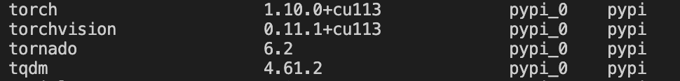

# Agricultural_Diseases_Dentification
 农业病虫害识别

## Steps To Run the Code
### Step 1: Install Anaconda
Go to the [Anaconda Website](https://www.anaconda.com/products/distribution) and choose a Python 3.x graphical installer.

### Step 2: Clone the Repository
In order to clone the repository, use the following git command in your command line.
```
git clone https://github.com/YiQuanMarx/Agricultural_Diseases_Dentification.git
```
and then move into the project directory with
```
cd Identification-of-agricultural-diseases-and-pests
```
When you run a resnet etc for comparison experiments, you can use a 30 series graphics card, you can configure the environment with the following command:

```python
pip3 install torch==1.10.0+cu113 torchvision==0.11.1+cu113 -f https://download.pytorch.org/whl/cu113/torch_stable.html -i https://pypi.douban.com/simple
```

### Step 3: Create a Python Environment

The code requires

* Cuda:11.3

* Python 3.8.1

  

  ```python
  pip3 install torch==1.10.0+cu113 torchvision==0.11.1+cu113 -f https://download.pytorch.org/whl/cu113/torch_stable.html -i https://pypi.douban.com/simple
  ```

## data
dm = downy mildew, 霜霉病  
pm = powdery mildew, 白粉病  
als = bacterial angular leaf spot, 细菌性角斑病  
tls = target leaf spot, 靶斑病  
gsb = gummy stem blight, ，蔓枯病  
fw = fusarium wilt, 枯萎病  
an = anthracnose, 炭疽病  

霜霉病 - http://www.nongyisheng.com/nongzi?id=uoktntj  
白粉病 - http://www.nongyisheng.com/nongzi?id=uizygcc  
细菌性角斑病 - http://www.nongyisheng.com/nongzi?id=uizezsy  
靶斑病 - http://www.nongyisheng.com/nongzi?id=uuwhllf  
蔓枯病 - http://www.nongyisheng.com/nongzi?id=uoktbkk  
枯萎病 - http://www.nongyisheng.com/nongzi?id=uokqdkq  
炭疽病 - http://www.nongyisheng.com/nongzi?id=uuwhrhl  

文件命名  
qid_#.jpg  
qid是每个问题在农医生的数据库里的id， 每个问题有0-6张照片不等。  

网站：  
"http://www.nongyisheng.com/p/detail.html?qid=" + qid  
json 数据网站  
"http://www.nongyisheng.com/question/detail?fr=pc&qid=" + qid + "&rn=1"  

## Repository structure

```
├── Agricultural_Diseases_Dentification
│   ├── draw_pic
│   ├── experiment
│      ├── exp1_model
│      ├── exp2_optimizer
│      ├── exp3_batch
│      ├── exp4_flooding
│   ├── log
│      ├── exp1
│      ├── exp2
│      ├── exp3
│      ├── exp4
│   ├── data
│      ├── train
│         ├── als
│         ├── an
│         ├── dm
│         ├── fw
│         ├── gsb
│         ├── pm
│         ├── tls
│      ├── val
│         ├── als
│         ├── an
│         ├── dm
│         ├── fw
│         ├── gsb
│         ├── pm
│         ├── tls
```
